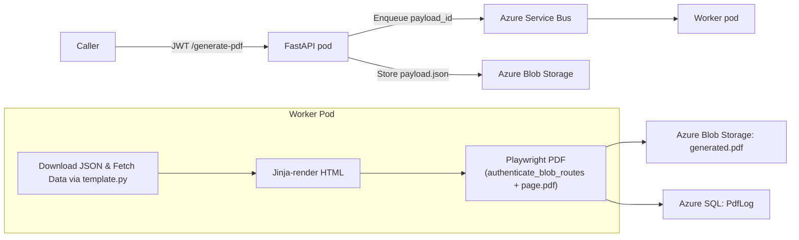

<p align="left">
  
</p>

# NAVA (Python) on Azure Kubernetes Service

NAVA is a scalable, Kubernetes‑hosted service for on‑demand PDF generation built with **FastAPI**, **Playwright**, **Azure Service Bus**, **Azure Blob Storage**, and **Azure SQL** – packaged as two containers (API + Worker) and deployed on AKS with Workload Identity.

---

## 📑 Table of Contents
1. [Introduction](#introduction)  
2. [Architecture](#architecture)  
3. [Features](#features)  
4. [Quick Start](#quick-start)  
5. [Secure One-Time POST Flow](#secure-one-time-post-flow)  
6. [Environment Variables](#environment-variables)  
7. [Azure Resources & RBAC](#azure-resources--rbac)  
8. [Building & Pushing Images](#building--pushing-images)  
9. [Kubernetes Deployment](#kubernetes-deployment)  
10. [Scaling](#scaling)  
11. [Templates](#templates)  
12. [Logging & Observability](#logging--observability)  
13. [Troubleshooting](#troubleshooting)  
14. [Repository Structure](#repository-structure)  
15. [Contributing](#contributing)  
16. [License](#license)

---

## Introduction
This micro-service renders HTML templates to PDF.  Clients send a small JSON payload (`template` + data) to the **API pod**; the payload is stored in Blob Storage and the blob name is en-queued on Service Bus.  One or more **Worker pods** consume the queue, feed the data into Playwright/Chromium, save the generated PDF back to Blob Storage, and write an audit row to Azure SQL.

Key design goals:
* **Burst-proof** – decouple request rate from rendering throughput via queue.
* **Zero secrets** – uses Azure Workload Identity so the pod never holds an access key.
* **Pluggable templates** – HTML + JS bundles mounted as a ConfigMap; no rebuild needed.
* **Multi-cloud auth** – validates **Auth0** *and* Azure AD JWTs at the API edge.

---

## Core Workflow

1. **User authentication & deep link**  
   The caller opens a URL such as  
   ```text
   GET /generate-pdf?template=product-de&isin=CH1234&date=latest
   ```  
   behind Azure AD or Auth0. FastAPI’s `verify_jwt()` dependency checks the bearer token and rejects unauthenticated requests.

2. **Enqueue render job (API pod)**  
   `main.py` wraps the request in a tiny JSON payload  
   ```json
   { 
     "template": "product-de",
     "params": { "isin": "CH1234", "date": "latest" }
   }
   ```  
   saves it in Azure Blob Storage, and publishes the blob-name on an Azure Service Bus queue.

3. **Fetch data (Worker pod)**  
   A Playwright worker dequeues the message, downloads the JSON, and dynamically imports the template’s Python module (e.g. `product_de.py`).  Calling `Report(params).fetch()` runs the relevant SQL against Azure SQL and returns a dictionary of placeholders (tables, SVG charts, scalar values).

4. **Render HTML**  
   The worker Jinja-renders the corresponding `<template>.html` with that dictionary, writes the result to a temporary file, and loads it in headless Chromium.  The template’s helper (`product_de_helper.py`, `crm_trade_invoice_helper.py`, …) adds an Azure AD bearer token to any `*.blob.core.windows.net` requests so private SVG/PNG assets can load.

5. **Generate & store PDF**  
   The helper also supplies `PDF_OPTIONS`, `get_header_html()`, and `get_footer_html()`.  Playwright calls `page.pdf(**PDF_OPTIONS, header_template=…, footer_template=…)`, creating the final A4 PDF.  The worker uploads the PDF to Blob Storage, then inserts an audit row in the `PdfLog` table (duration, success flag, error if any).

---

## Architecture


---

## Features
* 🔒 **Zero secrets** – pods authenticate with their managed identity.
* ⚡️ **Burst-friendly** – queue absorbs ≈1000 msg/s; workers autoscale.
* 📝 **Hot-swappable templates** – ship HTML/JS/CSS via ConfigMap or Azure File.
* 📄 **On-demand & async** – single endpoint, but sync mode optional.
* 🕵️ **Audit logging** – write render time and outcome into `PdfLog` table.
* 💾 **Claim-check pattern** – messages are small; large payload lives in Blob.
* 🐳 **Slim images** – multi-stage Dockerfile installs Chromium & `msodbcsql18`.
* 🛠 **GitOps ready** – kustomize overlays for dev/prod.

---

## Secure One-Time POST Flow
To prevent sharing and ensure only the intended caller can enqueue a job, we issue a short-lived, HMAC-signed link:

1. **Request link**  
   ```bash
   GET /link/{template}?ttl=30
   ```  
   **Response:**
   ```json
   {
     "url": "/generate-secure/{template}?t=<token>&exp=<timestamp>",
     "expires:<timestamp>"
   }
   ```
2. **Enqueue via secure POST**  
   ```bash
   POST /generate-secure/{template}?t=<token>&exp=<timestamp>
   Authorization: Bearer <JWT>
   Content-Type: application/json

   { "params": { … } }
   ```  
   The API verifies:
   ```text
   sig = HMAC_SHA256(
     base64url_decode($HMAC_SECRET_B64),
     "{template}|{claims.sub}|{exp}"
   )[:32]
   ```
   If `exp` is past or `sig` mismatches, the request is rejected (403/410).
3. **Proceed as normal** – PDF job enqueued and rendered; cache untouched.

---

## Quick Start
### Prerequisites
| Tool | Version |
|------|---------|
| Docker | ≥ 24 |
| Python | ≥ 3.12 |
| Azure CLI | ≥ 2.60 |
| kubectl | ≥ 1.30 |

### One-liner for local dev
```bash
# assumes Azure resources already exist and your az login has access
make run-api     # starts uvicorn with live reload
make run-worker  # launches worker with Playwright
```

`make run-all` spins up both plus a dev-container of SQL Edge.

### Running tests
```bash
pip install -r requirements-dev.txt
pytest -q
```

---

## Environment Variables
| Variable           | Required | Component | Description                                                      | Default     |
|--------------------|----------|-----------|------------------------------------------------------------------|-------------|
| `AZURE_TENANT_ID`   | ✔        | both      | Azure AD tenant                                                  | –           |
| `AZURE_AD_AUDIENCE` | ✔        | API       | Application ID URI for AAD tokens                                | –           |
| `AUTH0_DOMAIN`      | ✔        | API       | Auth0 tenant (e.g. `xyz.eu.auth0.com`)                           | –           |
| `AUTH0_API_AUDIENCE`| ✔        | API       | API identifier for Auth0                                         | –           |
| `HMAC_SECRET_B64`   | ✔        | API       | URL-safe Base64 256-bit secret for signed link generation        | –           |
| `SQL_SERVER`        | ✔        | worker    | SQL server FQDN                                                  | –           |
| `SQL_DB`            | ✔        | worker    | Database name                                                    | –           |
| `SB_NAMESPACE`      | ✔        | both      | Service Bus namespace                                            | –           |
| `SB_QUEUE`          | ✔        | both      | Queue name                                                       | `pdf-jobs`  |
| `STORAGE_URL`       | ✔        | both      | Blob account URL (e.g. `https://<acct>.blob.core.windows.net`)  | –           |
| `PAYLOAD_CONTAINER` | ✔        | both      | JSON payload container                                           | `pdfpayloads`|
| `OUTPUT_CONTAINER`  |          | worker    | PDF container                                                    | `pdfs`      |
| `SCRIPTS_DIR`       |          | worker    | Template mount path                                              | `/opt/app/scripts` |
| `WORKER_CONCURRENCY`|          | worker    | Parallel Playwright pages                                        | `3`         |
| `MAX_DELIVERY`      |          | worker    | Max SB deliveries before DLQ                                     | `5`         |
| `PDF_AUDIT_TABLE`   |          | worker    | Fully-qualified table for audit logs (e.g. `dbo.PdfLog`)         | `PdfLog`    |

> 💡 Set these via a **Kubernetes Secret**, **ConfigMap**, or `env:` stanza in your Deployment.

---

## Azure Resources & RBAC
| Resource               | Required Roles on UAMI                                      |
|------------------------|-------------------------------------------------------------|
| Service Bus namespace  | `Azure Service Bus Data Sender`, `Azure Service Bus Data Receiver` |
| Storage account        | `Storage Blob Data Contributor`, `Storage Blob Data Reader`      |
| Azure SQL database     | `db_datawriter`                                               |

```bash
az role assignment create \
  --assignee-object-id $MI_OBJID \
  --role "Storage Blob Data Contributor" \
  --scope $STORAGE_ACCOUNT_SCOPE
```

---

## Creating the **PdfLog** audit‑trail table in Azure SQL
The worker writes one row per PDF render into a table called **`PdfLog`**.  Run the script below once in your Azure SQL database (`PdfCore`, by default) before deploying.

```sql
-- ===================================================================
--  PdfLog  – audit / observability table for the PDF generator
-- ===================================================================
CREATE SCHEMA IF NOT EXISTS dbo;

CREATE TABLE dbo.PdfLog
(
    id           UNIQUEIDENTIFIER  NOT NULL,
    template     NVARCHAR(64)      NOT NULL,
    payload_id   NVARCHAR(260)     NOT NULL,
    duration_ms  INT               NOT NULL,
    success      BIT               NOT NULL,
    error_msg    NVARCHAR(MAX)     NULL,
    created_at   DATETIME2(3)      NOT NULL DEFAULT (SYSUTCDATETIME()),
    CONSTRAINT PK_PdfLog PRIMARY KEY (id)
);

CREATE INDEX IX_PdfLog_template_date
    ON dbo.PdfLog (template, created_at DESC);
```

### How to run it
| Option                 | Command                                                         |
|------------------------|-----------------------------------------------------------------|
| Azure Cloud Shell      | `az sql db query --server $SQL_SERVER --database PdfCore --query "EXEC(N'$(cat pdf_log.sql)')"` |
| SSMS / Azure Data Studio | Paste the script into a new query window and execute.       |
| Flyway / Liquibase      | Save as `V1__pdf_log.sql` and run your migration pipeline.    |

> **Tip:** Worker uses a parameterized insert; only `INSERT` permission is needed. Add retention policies as required.

---

## Building & Pushing Images
```bash
az acr build -r $ACR -t navav2-api:$(git rev-parse --short HEAD) -f Dockerfile.api .
az acr build -r $ACR -t navav2-worker:$(git rev-parse --short HEAD) -f Dockerfile.worker .
```
Multi-stage Dockerfiles install OS deps (`msodbcsql18`, `chromium`), copy code, then drop privileges.

---

## Kubernetes Deployment
```bash
kubectl apply -k k8s/
kubectl get deployments
kubectl get hpa
```
Manifests include **Deployment**, **HPA**, **NetworkPolicy**, **ServiceAccount** (Workload Identity), **PodDisruptionBudget**, and **Ingress** with TLS via cert-manager.

---

## Scaling
* **API** – CPU-based HPA (80% target).
* **Worker** – queue-length HPA (`azure.com/servicebus-queue`).

```yaml
annotations:
  autoscaling.azure.com/queueLength: "50"   # msgs per replica
```

---

## Templates
Templates live under `templates/`:
```
├─ <name>.html           # static markup
├─ <name>_helper.py      # header/footer + auth injection
└─ <name>.py             # Report.fetch() logic
```
Mount read-only at `/opt/app/scripts`. Restrict in prod with `ALLOWED_TEMPLATES` env var.

---

## Logging & Observability
* Structured **JSON logs** per line (`ts`, `event`, …) for Container Insights.
* **Metrics** – HPA via KEDA adapter; render time emitted as `pdf.done` / `pdf.error`.
* **Audit** – SQL table `PdfLog`.
* **Tracing** – optional OpenTelemetry hook in `worker.py`.

---

## Troubleshooting
| Symptom                             | Likely cause                                                       | Fix                                                                          |
|-------------------------------------|--------------------------------------------------------------------|-------------------------------------------------------------------------------|
| `ModuleNotFoundError: pyodbc`      | Synchronous DB engine or missing driver                            | Ensure worker image includes `msodbcsql18` and async-only SQL driver        |
| Worker pod restarts when idle       | Token expiry in long-lived Playwright pages                        | Upgrade to Playwright v2.4 (idle pages auto-close)                          |
| `401 Unauthorized` on API           | Missing or incorrect `aud`/issuer claim                            | Verify `AUTH0_API_AUDIENCE` / `AZURE_AD_AUDIENCE`                           |

---

## Repository Structure
```text
nava-v2-py/
├─ app/
│  ├─ main.py                 # FastAPI entrypoint
│  ├─ auth.py                 # JWT verification
│  ├─ db.py                   # Connection-string helper
│  └─ deps.py                 # Async engine + DI
├─ worker/
│  └─ worker.py               # Playwright renderer
├─ templates/                 # HTML bundles
├─ k8s/                       # Kustomize base + overlays
├─ Dockerfile.api             # API image
├─ Dockerfile.worker          # Worker image
├─ requirements-api.txt
├─ requirements-worker.txt
└─ README.md                  # this file
```

---

## Contributing
Pull requests are welcome.  Please run `make fmt lint test` before pushing.

---

## License
Apache 2.0 – see [LICENSE](LICENSE) for details.


